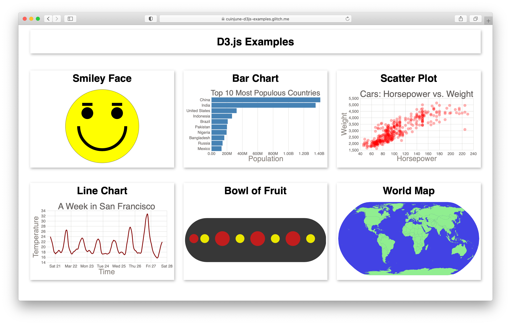

# D3.js Examples


## Description

This project is a web application that shows some simple [D3.js](https://d3js.org/) examples in one page for people who are interested in learning D3.js.

D3 stands for Data-Driven Documents. It is an open-source JavaScript library developed by Mike Bostock to create custom interactive data visualizations in the web browser using SVG, HTML and CSS.

The examples are originally from the Youtube tutorial [Data Visualization with D3.js - Full Tutorial Course](https://youtu.be/_8V5o2UHG0E) created by Curran Kelleher.  
I basically copied some of the examples while following the tutorial, modified them a bit (e.g. adding interactivity) then compiled them into a single-page web application.

Here's the [Live Demo on Glitch](https://cuinjune-d3js-examples.glitch.me/).

I created this app mainly for my own learning purpose but I think someone might find it useful to learn the basics of D3.js.
If you are interested in learning D3.js, I highly recommend the above mentioned Youtube tutorial since it covers not only how to use D3.js but also the concepts and techniques of data visualization in general.

## Setup

1. You need to have [Python](https://realpython.com/installing-python/) installed on your computer
2. Run the following commands in the Terminal
```
git clone https://github.com/cuinjune/d3js-examples.git
cd d3js-examples
python -m http.server 8080
```
3. Open your web browser and navigate to http://localhost:8080

## Author
* [Zack Lee](https://www.cuinjune.com/about): an MPS Candidate at [NYU ITP](https://itp.nyu.edu).
